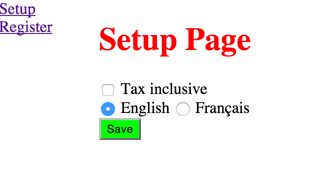

# Module Injection

Module Injection is a proof-of-concept for a new approach to building Single Page Apps (SPA). SPA are great, but the classic approach creates a disconnect between the server and the client, and introduces huge amount of unnecessary complexity for the client. This approach tries to address this.

## How to run this experiment

### Create ssl keys

```
mkdir keys
openssl genrsa -des3 -out keys/server.orig.key 2048
openssl rsa -in keys/server.orig.key -out keys/server.key
openssl req -new -key keys/server.key -out keys/server.csr
openssl x509 -req -days 365 -in keys/server.csr -signkey keys/server.key -out keys/server.crt
```

More info: https://coderwall.com/p/2gfk4w/your-first-spdy-app

### Install dependencies

```
npm install
bower install
```

### Install iojs

This experiment needs iojs (because ES6 reduces the boilersplate so much).

With [nvm](https://github.com/creationix/nvm): `nvm install iojs`.

### Run

If you've got iojs as main node version, you can do: `node index.js`

Otherwise: `nvm run iojs index.js`

Then navigate to `https://localhost:3333`

You should see something like:



## What is Module Injection

Right, let's get started.

Let's look at the file structure, focusing on the `www` directory.

```
/www
    /apps
    /platform
```

Already, we introduce 2 concepts: apps and platform. 
- **app** - single purpose web application, accessible by a unique URL
- **platform** - the building block of your apps.

Right, nothing too new for now. Let's dive into one of those app.

```
apps/
    setup/
        setup.html
        setup-ctrl.js
```

Each app is minimally made of 2 files: the base html, and the base js controller.

You've already seen the UI of the setup page in the screenshot above ^. 

The html looks like this:
```
<body ng-controller="SetupCtrl as setupCtrl">
    <vd-nav></vd-nav>
    <vd-main>
        <vd-title>Setup Page</vd-title>
        <form>
            <div><input type="checkbox" ng-model="setupCtrl.settings.taxInclusive"> Tax inclusive</div>
            <div>
                <input type="radio" ng-model="setupCtrl.settings.lang" value="en"> English
                <input type="radio" ng-model="setupCtrl.settings.lang" value="fr"> Français
            </div>
            <vd-submit-button type="submit" ng-click="setupCtrl.submit()">Save</vd-submit-button>
        </form>
    </vd-main>
</body>
```

The js looks like this:
```
angular.module('setup').controller('SetupCtrl', function (settingsResource) {
    this.settings = settingsResource.get();

    this.submit = function () {
        settingsResource.save(this.settings);
    };

});
```

You may notice few things:
- No head. No script tags.
- No CommonJs/AMD
- Html uses some components
- Js uses some custom services

Still, when we load the app, it works. You can save data to the server by clicking save. The ui components display properly. 

Looking at the source code of the html may bring some light:
```
<!DOCTYPE html>
<html ng-app="setup">
<head lang="en">
  <meta charset="UTF-8">
  <title>Setup Page</title>
  <script src="vendor/angular/angular.js"></script>
  <script src="bootstrap/setup.js"></script>
  <script src="apps/setup/setup-ctrl.js"></script>
  <script src="platform/resources/settings-resource/settings-resource.js"></script>
  <script src="platform/components/vd-nav/vd-nav.js"></script>
  <script src="platform/components/vd-main/vd-main.js"></script>
  <script src="platform/components/vd-title/vd-title.js"></script>
  <script src="platform/components/vd-submit-button/vd-submit-button.js"></script>
</head>
```
All the required dependency have been injected into the html file. **This is Module Injection**.

## How it works

In short, when asking for an app route, the server parses the files for dependencies, and inject them in the head.

In this example, it parses the js files for Angular services, and the html for custom component. But it could be anything things, including ES6 imports, html templates, css imports, etc.

Then, thanks to some rules & conventions, it knows which files to inject.

### Dynamic dependency resolution

Because the html is generated at runtime instead of build time, it's possible to do really interesting things.

If you go on the Register page and look the source, you will see tha the `registerCtrl` injects 2 services:
- lang
- taxPolicy
 
Now, if you look in the running app, you'll find that by default, those services are returned:

Lang:
```
// platform/languages/en/en.js
angular.module('vd').constant('lang',{
    welcome: 'Welcome!'
});
```
TaxPolicy:
```
// platform/policies/tax-policies/exclusive-tax-policy.js
angular.module('vd').factory('taxPolicy', function () {
    return function (amount) {
        return amount;
    }
});
```

Now, on the setup page, tick the "taxInclusive" checkbox, choose French as language, and click save.

Return to the register app. The welcome text now says "Bienvenue!", and the total includes tax. Let's look at what module have been injected.

Lang:
```
// platform/languages/fr/fr.js
angular.module('vd').constant('lang',{
    welcome: 'Bienvenue!'
});
```
TaxPolicy:
```
// platform/policies/tax-policies/inclusive-tax-policy.js
angular.module('vd').factory('taxPolicy', function () {
    return function (amount) {
        return amount * 1.15;
    }
});
```

The files are not the same, but because they register the same Angular DI module name, it doesn't matter.

### Benefits

Few of the benefits:

- Each file has a unique URL, so they can be individually cached. For a single URL, the **content will not change**. This is event better with the new [Cache API](https://developer.mozilla.org/en-US/docs/Web/API/Cache).
- Same module can be returned with different wrapper, e.g.
    - `platform/policies/tax-policies/exclusive-tax-policy--angular.js`
    - `platform/policies/tax-policies/exclusive-tax-policy--commonjs.js`
    - `platform/policies/tax-policies/exclusive-tax-policy--es6.js`
- Same logic can be served as REST API, e.g. to enforce same validation rules using shared policies
- Build based on browser feature - e.g. do not transpile if browser is ES6 compatible
    - `platform/policies/tax-policies/exclusive-tax-policy--angular--es6.js`
- No bower install / npm install required to run the client. It uses "Build as a Service".
- The Module Locator can use any set of rules required, including:
    - Languages
    - Location
    - Type of account (e.g. trial vs premium)
    - Experiments being run
    - Settings, like custom business rules
    - Themes
    - Etc.
- Apps treat Modules as API, not dependencies to be embedded. This enables "auto-update" apps. On the long term, this will greatly reduce maintenance cost and technical debt.

### Performance considerations

For complex app, the number of dependency will quickly become very large. This would become a problem with HTTP/1.1 as the number of concurrent request is usually around 6. But that changes with the introduction of SPDY / HTTP/2.

This new approach can in fact improve dramatically the performance of the apps using Module Injection:

- Only one instance of a Module exist, so there are shared by every apps, instead of having the same code embedded in each app.
- HTTP/2 multiplexes all the small files efficiently.
- Server knows all the files the clients needs and uses HTTP Push to sent everything that is needed upfront.
- Cache API & Services Worker mean individual files can be be cache, and updated in the background.
- Each Module URL is idempotent, so they can be can efficiently on the server.
- Static analysis of the files for dependencies only needs to happen once and can then be cached.

### Challenges

Of course there are still interesting problems to be solved:
- Automated test coverage must be really good to catch regression over many apps
- Automated test must be able to know what apps consumer what modules. Should be feasible if it talks to the same Module Injection API.
- Caching is possible but more complex
